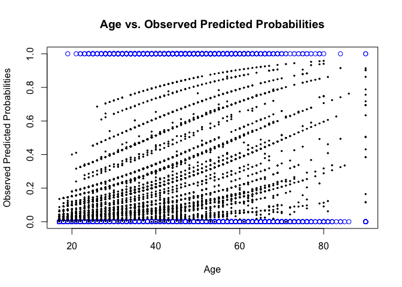
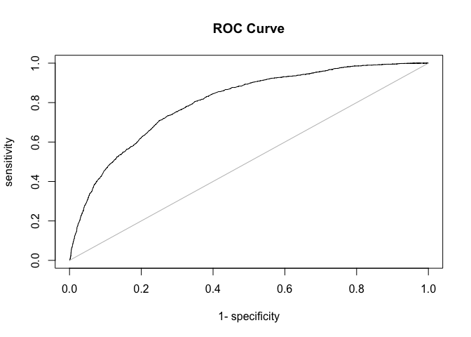
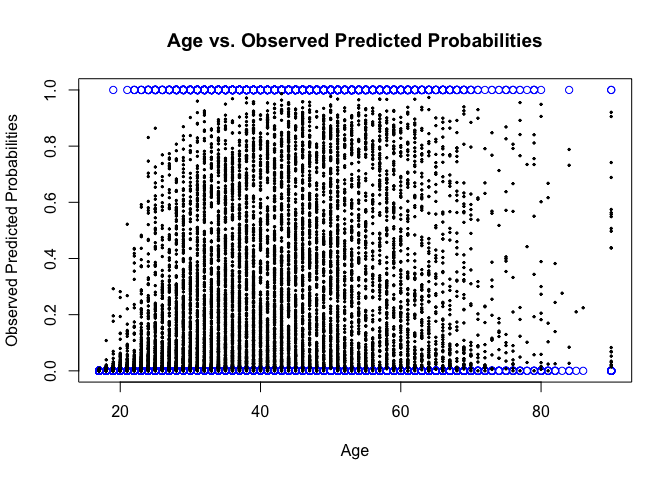
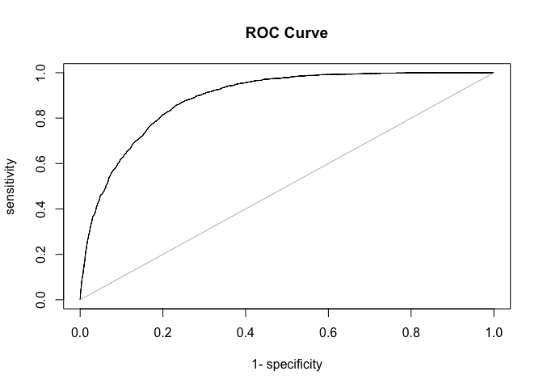

Machine Learning in R: Census Data
================
Timothy Pace
2/16/2017

Preprocessing
-------------

``` r
#install.packages("AUC")
#install.packages("caret")
#install.packages('e1071', dependencies=TRUE)
library(AUC)
```

    ## AUC 0.3.0

    ## Type AUCNews() to see the change log and ?AUC to get an overview.

``` r
library(caret)
```

    ## Loading required package: lattice

    ## Loading required package: ggplot2

    ## 
    ## Attaching package: 'caret'

    ## The following objects are masked from 'package:AUC':
    ## 
    ##     sensitivity, specificity

``` r
data <- read.csv("census data.csv")
```

Makes a new column in the dataset that is a 0,1 response for &gt;50K or &lt;=50k

``` r
data$income.g50 <- rep(0, nrow(data))
data$income.g50[data$income==" >50K"] <- 1
```

Runs a logistic regression looking at the odds ratios of level of education adjusting for age, sex, and race.
-------------------------------------------------------------------------------------------------------------

``` r
mod <- glm(income.g50 ~ education + age + sex + race, 
           data=data[,!colnames(data)%in%"income"], family="binomial")
summary(mod)
```

    ## 
    ## Call:
    ## glm(formula = income.g50 ~ education + age + sex + race, family = "binomial", 
    ##     data = data[, !colnames(data) %in% "income"])
    ## 
    ## Deviance Residuals: 
    ##     Min       1Q   Median       3Q      Max  
    ## -2.4997  -0.6802  -0.4460  -0.1114   2.8328  
    ## 
    ## Coefficients:
    ##                           Estimate Std. Error z value Pr(>|z|)    
    ## (Intercept)              -6.865618   0.504710 -13.603  < 2e-16 ***
    ## education 11th            0.296538   0.327880   0.904  0.36578    
    ## education 12th            0.724955   0.386826   1.874  0.06092 .  
    ## education 1st-4th        -0.180178   0.656420  -0.274  0.78371    
    ## education 5th-6th        -1.065786   0.638832  -1.668  0.09525 .  
    ## education 7th-8th        -0.055193   0.344602  -0.160  0.87275    
    ## education 9th            -0.472650   0.422347  -1.119  0.26310    
    ## education Assoc-acdm      1.793180   0.276081   6.495 8.30e-11 ***
    ## education Assoc-voc       1.806001   0.265792   6.795 1.08e-11 ***
    ## education Bachelors       2.498991   0.246065  10.156  < 2e-16 ***
    ## education Doctorate       3.465742   0.316322  10.956  < 2e-16 ***
    ## education HS-grad         1.099579   0.244388   4.499 6.82e-06 ***
    ## education Masters         2.910088   0.256902  11.328  < 2e-16 ***
    ## education Preschool     -10.727247 130.041047  -0.082  0.93426    
    ## education Prof-school     3.834590   0.308031  12.449  < 2e-16 ***
    ## education Some-college    1.590668   0.246311   6.458 1.06e-10 ***
    ## age                       0.043369   0.002061  21.043  < 2e-16 ***
    ## sex Male                  1.291684   0.066444  19.440  < 2e-16 ***
    ## race Asian-Pac-Islander   1.009867   0.457049   2.210  0.02714 *  
    ## race Black                1.119303   0.442857   2.527  0.01149 *  
    ## race Other                0.213828   0.654001   0.327  0.74370    
    ## race White                1.392564   0.431938   3.224  0.00126 ** 
    ## ---
    ## Signif. codes:  0 '***' 0.001 '**' 0.01 '*' 0.05 '.' 0.1 ' ' 1
    ## 
    ## (Dispersion parameter for binomial family taken to be 1)
    ## 
    ##     Null deviance: 11151.2  on 9999  degrees of freedom
    ## Residual deviance:  8900.2  on 9978  degrees of freedom
    ## AIC: 8944.2
    ## 
    ## Number of Fisher Scoring iterations: 12

Calculates the odds ratios for high earnings (remember the output of summary() gives log odds ratios) for having a masters degree versus 1st - 4th grade education. Are these statistically significant? What about multiple comparisons?
-----------------------------------------------------------------------------------------------------------------------------------------------------------------------------------------------------------------------------------------

``` r
masters <- exp(2.910088)
masters
```

    ## [1] 18.35841

``` r
first_fourth <- exp(-0.180178)
first_fourth
```

    ## [1] 0.8351215

``` r
bonferroni <- .05 / 21
bonferroni
```

    ## [1] 0.002380952

The odds ratio for earning $50,000 a year having and masters degree is 18.35841. These results are statistically significant (p &lt; 0.001). With multiple comparisons, the results are still statistically significant for having a masters degree (p &lt; 0.002380952).

The odds ratio for earning $50,000 a year and having a 1st - 4th grade education is 0.8351215. These results are not statistically significant (p &gt; 0.05). With multiple comparisons, the results are still not statistically significant for having a masters degree (p &gt; 0.002380952).

Examines the effects of age and sex. Again, are they statistically significant? Are they practically significant? Are they fair?
--------------------------------------------------------------------------------------------------------------------------------

``` r
age_exp <- exp(0.043369)
age_exp
```

    ## [1] 1.044323

``` r
sex <- exp(1.291684)
sex
```

    ## [1] 3.638909

Keeping all other predictive variables constant, by increasing age by 1 year, the log odds of earning $50,000 a year increases by 0.043369 (odds ratio = 1.044323). These results are statistically significant, as the probability of seeing a value as or more extreme if the null hypothesis (i.e., there is no effect of age) is true in the direction of the alternative hypothesis (i.e., age has an effect) is less than 0.001. The results are practically significant for age, as greater age may be associated with greater experience in the workforce, which may be associated earning more money. These results are not necessarily fair, as it means older individuals are more likely to be paid more based on seniority.

Keeping all other predictive variables constant, by being a male, the log odds of earning $50,000 a year increase by 1.291684 (odds ratio = 3.638909). These results are statistically significant, as the probability of seeing a value as or more extreme if the null hypothesis (i.e. gender does not have an effect) is true in the direction of the alternative hypothesis (i.e. gender has an effect) is less than 0.001. These results are practically significant, as sexism and pay discrimination is well documented in the US workforce. These results are not fair, as there is no reason why men should earn more than women.

Exploring Relationships II: Plots age by the outcome and the observed predicted probabilities. Why are the predicted probabilities so variable?
-----------------------------------------------------------------------------------------------------------------------------------------------

``` r
x <- data$age
plot(x, data$income.g50, col="blue", xlab = "Age", 
     ylab = "Observed Predicted Probabilities",
     main = "Age vs. Observed Predicted Probabilities")
fits <- fitted(mod)
points(x, fits, pch=19, cex=0.3)
```



As age, education, and gender (i.e., being the categorical variable of male) increase, there is a logistic association between earning $50,000 a year or more. The observed predicted probabilities are so variable because there are many (i.e. 21) predictive variables or computations that account for variation in the model. Moreover, in addition to there being so many explanatory predictor variables, there could be high variability in the explanatory predictors as well.

Explores different cutoffs for the probabilities: Tabulates outcomes with a cutoff of 0.25, 0.5, and 0.75. Which has the lowest percent error?
----------------------------------------------------------------------------------------------------------------------------------------------

``` r
tab <- table(data$income.g50, fits>=0.25)
(tab[1,2]+tab[2,1])/sum(tab)
```

    ## [1] 0.2662

``` r
tab <- table(data$income.g50, fits>=0.5)
(tab[1,2]+tab[2,1])/sum(tab)
```

    ## [1] 0.2061

``` r
tab <- table(data$income.g50, fits>=0.75)
(tab[1,2]+tab[2,1])/sum(tab)
```

    ## [1] 0.2307

The cutoff of 0.5 has the lowest percent error (0.2061).

Examines this model by plotting the ROC curve and calculating the AUC.
----------------------------------------------------------------------

``` r
y <- factor(data$income.g50)
rr <- roc(fits, y)
plot(rr, main = "ROC Curve")
```



``` r
auc(rr)
```

    ## [1] 0.8021133

The AUC is 0.8021133.

Evaluating Model 1: How well does it fit?
-----------------------------------------

The area under the curve is is .8021133, which recieved a B (0.8-0.9). It could be better, however, by being greater than 0.9.

Let'ss formulate another model.
-------------------------------

### Fits a model with all covariates (except income). Do you see the same patterns for level of schooling?

``` r
mod <- glm(income.g50~., data=data[,!colnames(data)%in%c("income")], 
           family="binomial")
```

    ## Warning: glm.fit: fitted probabilities numerically 0 or 1 occurred

``` r
summary(mod)
```

    ## 
    ## Call:
    ## glm(formula = income.g50 ~ ., family = "binomial", data = data[, 
    ##     !colnames(data) %in% c("income")])
    ## 
    ## Deviance Residuals: 
    ##     Min       1Q   Median       3Q      Max  
    ## -2.6128  -0.5605  -0.2026  -0.0001   3.2983  
    ## 
    ## Coefficients: (2 not defined because of singularities)
    ##                                             Estimate Std. Error z value
    ## (Intercept)                               -9.931e+00  7.766e-01 -12.787
    ## age                                        2.801e-02  2.783e-03  10.062
    ## work.class Federal-gov                     1.071e+00  2.656e-01   4.032
    ## work.class Local-gov                       1.906e-01  2.418e-01   0.789
    ## work.class Never-worked                   -1.359e+01  9.580e+02  -0.014
    ## work.class Private                         3.800e-01  2.144e-01   1.772
    ## work.class Self-emp-inc                    8.081e-01  2.563e-01   3.153
    ## work.class Self-emp-not-inc                2.786e-01  2.334e-01   1.194
    ## work.class State-gov                       2.782e-01  2.620e-01   1.062
    ## work.class Without-pay                    -1.459e+01  8.999e+02  -0.016
    ## final.weight                               1.082e-06  2.937e-07   3.684
    ## education 11th                             5.089e-01  3.490e-01   1.458
    ## education 12th                             6.785e-01  4.153e-01   1.634
    ## education 1st-4th                          2.756e-01  7.168e-01   0.384
    ## education 5th-6th                         -7.479e-01  6.666e-01  -1.122
    ## education 7th-8th                          1.145e-01  3.636e-01   0.315
    ## education 9th                             -2.324e-01  4.387e-01  -0.530
    ## education Assoc-acdm                       1.466e+00  3.018e-01   4.857
    ## education Assoc-voc                        1.473e+00  2.868e-01   5.136
    ## education Bachelors                        2.092e+00  2.668e-01   7.841
    ## education Doctorate                        2.892e+00  3.582e-01   8.075
    ## education HS-grad                          9.690e-01  2.599e-01   3.728
    ## education Masters                          2.429e+00  2.838e-01   8.558
    ## education Preschool                       -1.309e+01  4.975e+02  -0.026
    ## education Prof-school                      3.346e+00  3.489e-01   9.593
    ## education Some-college                     1.412e+00  2.637e-01   5.356
    ## years.school                                      NA         NA      NA
    ## marital.status Married-AF-spouse           2.779e+00  9.247e-01   3.005
    ## marital.status Married-civ-spouse          2.571e+00  4.121e-01   6.240
    ## marital.status Married-spouse-absent       1.422e-01  3.693e-01   0.385
    ## marital.status Never-married              -5.452e-01  1.435e-01  -3.799
    ## marital.status Separated                  -2.253e-01  2.789e-01  -0.808
    ## marital.status Widowed                     2.295e-01  2.378e-01   0.965
    ## occupation Adm-clerical                    1.308e-01  1.719e-01   0.761
    ## occupation Armed-Forces                    5.030e-01  2.025e+00   0.248
    ## occupation Craft-repair                    3.629e-01  1.471e-01   2.468
    ## occupation Exec-managerial                 9.648e-01  1.510e-01   6.389
    ## occupation Farming-fishing                -8.811e-01  2.372e-01  -3.714
    ## occupation Handlers-cleaners              -5.332e-01  2.531e-01  -2.107
    ## occupation Machine-op-inspct              -4.981e-02  1.885e-01  -0.264
    ## occupation Other-service                  -7.228e-01  2.209e-01  -3.272
    ## occupation Priv-house-serv                -1.482e+01  3.074e+02  -0.048
    ## occupation Prof-specialty                  8.118e-01  1.628e-01   4.986
    ## occupation Protective-serv                 7.941e-01  2.272e-01   3.495
    ## occupation Sales                           5.718e-01  1.565e-01   3.655
    ## occupation Tech-support                    8.180e-01  2.111e-01   3.874
    ## occupation Transport-moving                       NA         NA      NA
    ## relationship Not-in-family                 1.066e+00  4.082e-01   2.612
    ## relationship Other-relative                9.728e-02  3.960e-01   0.246
    ## relationship Own-child                    -1.158e-01  3.979e-01  -0.291
    ## relationship Unmarried                     8.553e-01  4.379e-01   1.953
    ## relationship Wife                          1.414e+00  1.734e-01   8.153
    ## race Asian-Pac-Islander                    1.297e+00  5.309e-01   2.443
    ## race Black                                 1.582e+00  4.790e-01   3.303
    ## race Other                                 6.241e-01  7.072e-01   0.882
    ## race White                                 1.477e+00  4.642e-01   3.182
    ## sex Male                                   8.170e-01  1.294e-01   6.314
    ## hours.per.week                             2.709e-02  2.802e-03   9.667
    ## native.country Cambodia                   -1.570e+01  2.400e+03  -0.007
    ## native.country Canada                     -5.204e-02  5.318e-01  -0.098
    ## native.country China                      -6.827e-01  7.817e-01  -0.873
    ## native.country Columbia                   -1.466e+01  5.030e+02  -0.029
    ## native.country Cuba                        6.734e-02  6.530e-01   0.103
    ## native.country Dominican-Republic          4.164e-01  1.179e+00   0.353
    ## native.country Ecuador                    -1.097e+00  1.265e+00  -0.867
    ## native.country El-Salvador                -1.070e+00  1.101e+00  -0.972
    ## native.country England                    -8.452e-02  5.520e-01  -0.153
    ## native.country France                     -1.111e-01  9.069e-01  -0.122
    ## native.country Germany                    -8.578e-02  4.975e-01  -0.172
    ## native.country Greece                     -2.564e-01  1.251e+00  -0.205
    ## native.country Guatemala                  -1.296e+01  4.019e+02  -0.032
    ## native.country Haiti                       1.956e-01  1.228e+00   0.159
    ## native.country Holand-Netherlands         -1.142e+01  2.400e+03  -0.005
    ## native.country Honduras                   -1.226e+01  1.661e+03  -0.007
    ## native.country Hong                       -9.191e-01  1.279e+00  -0.719
    ## native.country Hungary                    -6.953e-01  1.206e+00  -0.576
    ## native.country India                      -7.849e-01  5.551e-01  -1.414
    ## native.country Iran                       -7.106e-01  6.707e-01  -1.059
    ## native.country Ireland                     2.469e+00  1.112e+00   2.220
    ## native.country Italy                       3.133e-01  5.871e-01   0.534
    ## native.country Jamaica                    -1.495e+00  1.163e+00  -1.285
    ## native.country Japan                       5.607e-01  7.278e-01   0.770
    ## native.country Laos                       -1.290e+01  1.278e+03  -0.010
    ## native.country Mexico                     -5.061e-01  4.300e-01  -1.177
    ## native.country Nicaragua                  -1.277e+01  5.948e+02  -0.021
    ## native.country Outlying-US(Guam-USVI-etc) -1.372e+01  1.639e+03  -0.008
    ## native.country Peru                       -6.137e-01  1.185e+00  -0.518
    ## native.country Philippines                 4.936e-01  4.786e-01   1.031
    ## native.country Poland                     -6.022e-01  7.578e-01  -0.795
    ## native.country Portugal                   -5.827e-01  8.321e-01  -0.700
    ## native.country Puerto-Rico                -2.545e-01  8.308e-01  -0.306
    ## native.country Scotland                    1.799e+00  2.329e+00   0.772
    ## native.country South                       1.198e+00  7.514e-01   1.594
    ## native.country Taiwan                      8.449e-01  8.614e-01   0.981
    ## native.country Thailand                   -1.556e+01  7.463e+02  -0.021
    ## native.country Trinadad&Tobago            -1.489e+01  6.211e+02  -0.024
    ## native.country United-States               9.913e-02  2.352e-01   0.422
    ## native.country Vietnam                    -1.438e+01  4.332e+02  -0.033
    ## native.country Yugoslavia                  9.149e-01  1.152e+00   0.794
    ##                                           Pr(>|z|)    
    ## (Intercept)                                < 2e-16 ***
    ## age                                        < 2e-16 ***
    ## work.class Federal-gov                    5.53e-05 ***
    ## work.class Local-gov                      0.430391    
    ## work.class Never-worked                   0.988680    
    ## work.class Private                        0.076345 .  
    ## work.class Self-emp-inc                   0.001614 ** 
    ## work.class Self-emp-not-inc               0.232498    
    ## work.class State-gov                      0.288261    
    ## work.class Without-pay                    0.987064    
    ## final.weight                              0.000229 ***
    ## education 11th                            0.144783    
    ## education 12th                            0.102305    
    ## education 1st-4th                         0.700626    
    ## education 5th-6th                         0.261868    
    ## education 7th-8th                         0.752799    
    ## education 9th                             0.596310    
    ## education Assoc-acdm                      1.19e-06 ***
    ## education Assoc-voc                       2.81e-07 ***
    ## education Bachelors                       4.48e-15 ***
    ## education Doctorate                       6.76e-16 ***
    ## education HS-grad                         0.000193 ***
    ## education Masters                          < 2e-16 ***
    ## education Preschool                       0.979003    
    ## education Prof-school                      < 2e-16 ***
    ## education Some-college                    8.50e-08 ***
    ## years.school                                    NA    
    ## marital.status Married-AF-spouse          0.002656 ** 
    ## marital.status Married-civ-spouse         4.39e-10 ***
    ## marital.status Married-spouse-absent      0.700213    
    ## marital.status Never-married              0.000145 ***
    ## marital.status Separated                  0.419369    
    ## marital.status Widowed                    0.334629    
    ## occupation Adm-clerical                   0.446735    
    ## occupation Armed-Forces                   0.803801    
    ## occupation Craft-repair                   0.013603 *  
    ## occupation Exec-managerial                1.67e-10 ***
    ## occupation Farming-fishing                0.000204 ***
    ## occupation Handlers-cleaners              0.035141 *  
    ## occupation Machine-op-inspct              0.791561    
    ## occupation Other-service                  0.001069 ** 
    ## occupation Priv-house-serv                0.961563    
    ## occupation Prof-specialty                 6.16e-07 ***
    ## occupation Protective-serv                0.000474 ***
    ## occupation Sales                          0.000257 ***
    ## occupation Tech-support                   0.000107 ***
    ## occupation Transport-moving                     NA    
    ## relationship Not-in-family                0.009007 ** 
    ## relationship Other-relative               0.805962    
    ## relationship Own-child                    0.770953    
    ## relationship Unmarried                    0.050796 .  
    ## relationship Wife                         3.55e-16 ***
    ## race Asian-Pac-Islander                   0.014551 *  
    ## race Black                                0.000956 ***
    ## race Other                                0.377522    
    ## race White                                0.001464 ** 
    ## sex Male                                  2.71e-10 ***
    ## hours.per.week                             < 2e-16 ***
    ## native.country Cambodia                   0.994780    
    ## native.country Canada                     0.922047    
    ## native.country China                      0.382520    
    ## native.country Columbia                   0.976742    
    ## native.country Cuba                       0.917856    
    ## native.country Dominican-Republic         0.723996    
    ## native.country Ecuador                    0.385726    
    ## native.country El-Salvador                0.331226    
    ## native.country England                    0.878306    
    ## native.country France                     0.902526    
    ## native.country Germany                    0.863105    
    ## native.country Greece                     0.837672    
    ## native.country Guatemala                  0.974279    
    ## native.country Haiti                      0.873493    
    ## native.country Holand-Netherlands         0.996204    
    ## native.country Honduras                   0.994109    
    ## native.country Hong                       0.472426    
    ## native.country Hungary                    0.564316    
    ## native.country India                      0.157345    
    ## native.country Iran                       0.289381    
    ## native.country Ireland                    0.026418 *  
    ## native.country Italy                      0.593623    
    ## native.country Jamaica                    0.198734    
    ## native.country Japan                      0.441016    
    ## native.country Laos                       0.991945    
    ## native.country Mexico                     0.239145    
    ## native.country Nicaragua                  0.982877    
    ## native.country Outlying-US(Guam-USVI-etc) 0.993321    
    ## native.country Peru                       0.604662    
    ## native.country Philippines                0.302354    
    ## native.country Poland                     0.426827    
    ## native.country Portugal                   0.483797    
    ## native.country Puerto-Rico                0.759396    
    ## native.country Scotland                   0.439892    
    ## native.country South                      0.110847    
    ## native.country Taiwan                     0.326663    
    ## native.country Thailand                   0.983363    
    ## native.country Trinadad&Tobago            0.980871    
    ## native.country United-States              0.673385    
    ## native.country Vietnam                    0.973523    
    ## native.country Yugoslavia                 0.426912    
    ## ---
    ## Signif. codes:  0 '***' 0.001 '**' 0.01 '*' 0.05 '.' 0.1 ' ' 1
    ## 
    ## (Dispersion parameter for binomial family taken to be 1)
    ## 
    ##     Null deviance: 11151.2  on 9999  degrees of freedom
    ## Residual deviance:  6997.9  on 9903  degrees of freedom
    ## AIC: 7191.9
    ## 
    ## Number of Fisher Scoring iterations: 15

While the patterns for the level of schooling are somewhat similar to the previous model, the coefficients have changed for most variables to some degree (e.g., the coefficient for masters is 2.49 vs. 2.91, and 1st-4th is 0.0276 vs. -0.180).

Plots the age by the outcome and the observed predicted probabilities. Do the predicted probabilities have the same pattern as the other model?
-----------------------------------------------------------------------------------------------------------------------------------------------

``` r
x <- data$age
plot(x, data$income.g50, col="blue", xlab = "Age", 
     ylab = "Observed Predicted Probabilities",
     main = "Age vs. Observed Predicted Probabilities")
fits <- fitted(mod)
points(x, fits, pch=19, cex=0.3)
```



The new predicited probabilities do not have the same pattern as the old model, and there appears to be much more variability in the new model. This is because there are many more predictor variables and calculations that the new model is taking into account versus the old model, which only had 21. Moreover, could be high variability in the numerous explanatory or predictive variables in the new model as well changing the pattern.

Calculates the percent error as before for cutoffs 0.25, 0.5, 0.75. Which cutoff has the lowest percent error? Does this model perform better than the other model?
-------------------------------------------------------------------------------------------------------------------------------------------------------------------

``` r
tab <- table(data$income.g50, fits>=0.25)
(tab[1,2]+tab[2,1])/sum(tab) #0.25
```

    ## [1] 0.2071

``` r
tab <- table(data$income.g50, fits>=0.5)
(tab[1,2]+tab[2,1])/sum(tab) #0.5
```

    ## [1] 0.1659

``` r
tab <- table(data$income.g50, fits>=0.75)
(tab[1,2]+tab[2,1])/sum(tab) #0.75
```

    ## [1] 0.1943

The cutoff of 0.5 has the lowest percent error (0.1659). This model therefore performs better than the other model, with the lowest standard error (0.1659 vs. 0.2061).

Model 2 Evaluation: Plots the ROC and calculate the AUC. Again, does this model out perform the other model?
------------------------------------------------------------------------------------------------------------

``` r
y <- factor(data$income.g50)
rr <- roc(fits, y)
plot(rr, main = "ROC Curve")
```



``` r
auc(rr)
```

    ## [1] 0.8893198

The AUC for this model is 0.8893198. Therefore, this model outperforms the other model with a higher AUC (0.8893198 vs 0.8021133).

Runs 10-fold cross validation on the model to determine the mean AUROC.
-----------------------------------------------------------------------

``` r
control <- trainControl(method="cv", number=10, classProbs=TRUE, savePredictions = TRUE, summaryFunction=twoClassSummary)

data$income.g50_fact <- rep(NA, length(data$income.g50))
data$income.g50_fact[data$income.g50 == 0] <- "IncomeLess50k"
data$income.g50_fact[data$income.g50 >= 1] <- "IncomeGreater50k"
verbose = FALSE

data$income.g50 <- NULL
data$income <- NULL

fit <- train(income.g50_fact ~ ., data = data, 
             method="glm", family = "binomial", metric="ROC", trControl=control)
```

    ## Warning: glm.fit: fitted probabilities numerically 0 or 1 occurred

    ## Warning in predict.lm(object, newdata, se.fit, scale = 1, type =
    ## ifelse(type == : prediction from a rank-deficient fit may be misleading

    ## Warning in predict.lm(object, newdata, se.fit, scale = 1, type =
    ## ifelse(type == : prediction from a rank-deficient fit may be misleading

    ## Warning: glm.fit: fitted probabilities numerically 0 or 1 occurred

    ## Warning in predict.lm(object, newdata, se.fit, scale = 1, type =
    ## ifelse(type == : prediction from a rank-deficient fit may be misleading

    ## Warning in predict.lm(object, newdata, se.fit, scale = 1, type =
    ## ifelse(type == : prediction from a rank-deficient fit may be misleading

    ## Warning: glm.fit: fitted probabilities numerically 0 or 1 occurred

    ## Warning in predict.lm(object, newdata, se.fit, scale = 1, type =
    ## ifelse(type == : prediction from a rank-deficient fit may be misleading

    ## Warning in predict.lm(object, newdata, se.fit, scale = 1, type =
    ## ifelse(type == : prediction from a rank-deficient fit may be misleading

    ## Warning: glm.fit: fitted probabilities numerically 0 or 1 occurred

    ## Warning in predict.lm(object, newdata, se.fit, scale = 1, type =
    ## ifelse(type == : prediction from a rank-deficient fit may be misleading

    ## Warning in predict.lm(object, newdata, se.fit, scale = 1, type =
    ## ifelse(type == : prediction from a rank-deficient fit may be misleading

    ## Warning: glm.fit: fitted probabilities numerically 0 or 1 occurred

    ## Warning in predict.lm(object, newdata, se.fit, scale = 1, type =
    ## ifelse(type == : prediction from a rank-deficient fit may be misleading

    ## Warning in predict.lm(object, newdata, se.fit, scale = 1, type =
    ## ifelse(type == : prediction from a rank-deficient fit may be misleading

    ## Warning: glm.fit: fitted probabilities numerically 0 or 1 occurred

    ## Warning in predict.lm(object, newdata, se.fit, scale = 1, type =
    ## ifelse(type == : prediction from a rank-deficient fit may be misleading

    ## Warning in predict.lm(object, newdata, se.fit, scale = 1, type =
    ## ifelse(type == : prediction from a rank-deficient fit may be misleading

    ## Warning: glm.fit: fitted probabilities numerically 0 or 1 occurred

    ## Warning in predict.lm(object, newdata, se.fit, scale = 1, type =
    ## ifelse(type == : prediction from a rank-deficient fit may be misleading

    ## Warning in predict.lm(object, newdata, se.fit, scale = 1, type =
    ## ifelse(type == : prediction from a rank-deficient fit may be misleading

    ## Warning: glm.fit: fitted probabilities numerically 0 or 1 occurred

    ## Warning in predict.lm(object, newdata, se.fit, scale = 1, type =
    ## ifelse(type == : prediction from a rank-deficient fit may be misleading

    ## Warning in predict.lm(object, newdata, se.fit, scale = 1, type =
    ## ifelse(type == : prediction from a rank-deficient fit may be misleading

    ## Warning: glm.fit: fitted probabilities numerically 0 or 1 occurred

    ## Warning in predict.lm(object, newdata, se.fit, scale = 1, type =
    ## ifelse(type == : prediction from a rank-deficient fit may be misleading

    ## Warning in predict.lm(object, newdata, se.fit, scale = 1, type =
    ## ifelse(type == : prediction from a rank-deficient fit may be misleading

    ## Warning: glm.fit: fitted probabilities numerically 0 or 1 occurred

    ## Warning in predict.lm(object, newdata, se.fit, scale = 1, type =
    ## ifelse(type == : prediction from a rank-deficient fit may be misleading

    ## Warning in predict.lm(object, newdata, se.fit, scale = 1, type =
    ## ifelse(type == : prediction from a rank-deficient fit may be misleading

    ## Warning: glm.fit: fitted probabilities numerically 0 or 1 occurred

``` r
# display results
print(fit)
```

    ## Generalized Linear Model 
    ## 
    ## 10000 samples
    ##    12 predictor
    ##     2 classes: 'IncomeGreater50k', 'IncomeLess50k' 
    ## 
    ## No pre-processing
    ## Resampling: Cross-Validated (10 fold) 
    ## Summary of sample sizes: 9000, 9000, 9000, 9000, 9000, 9000, ... 
    ## Resampling results:
    ## 
    ##   ROC        Sens       Spec     
    ##   0.8799312  0.5608196  0.9168741
